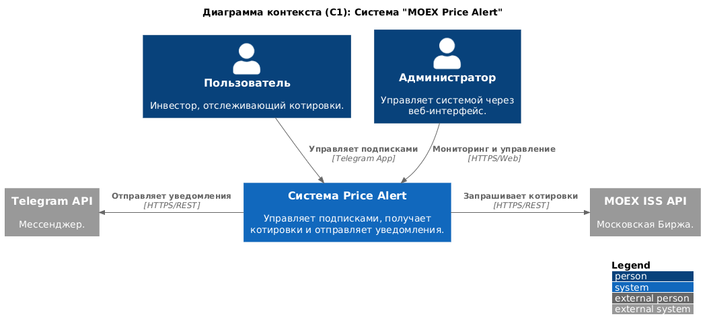
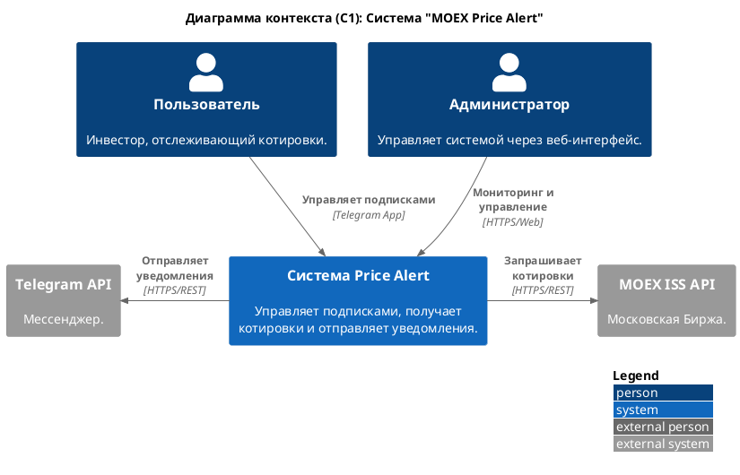
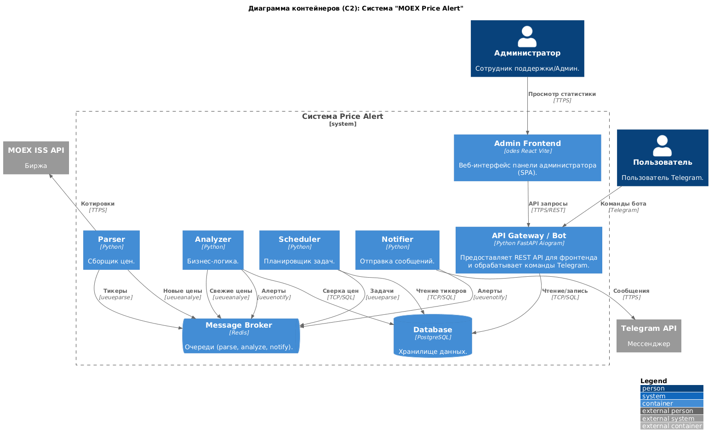
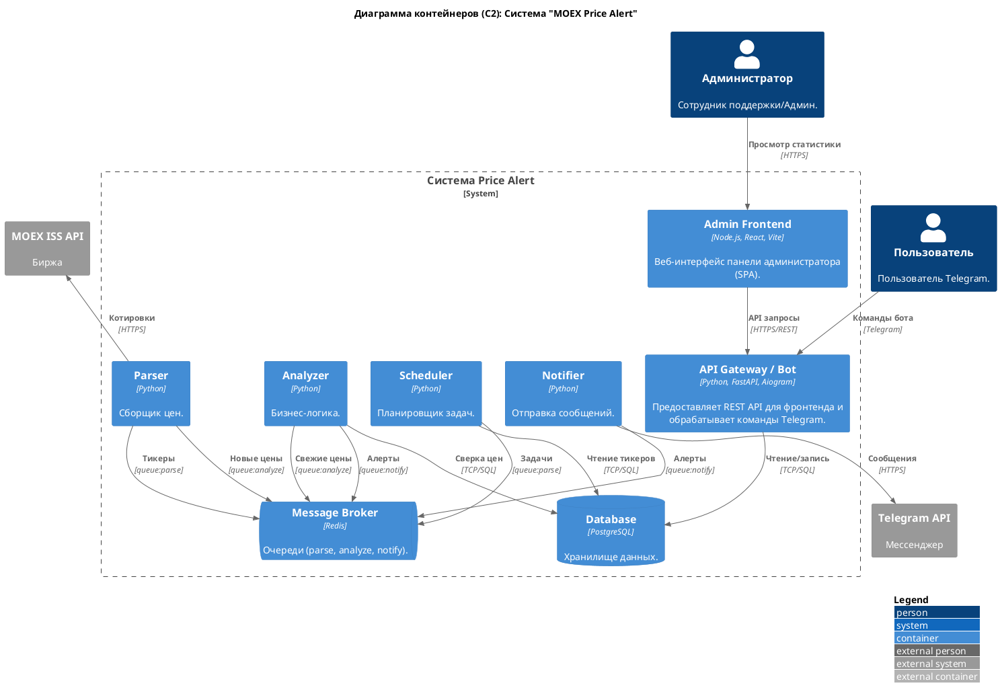
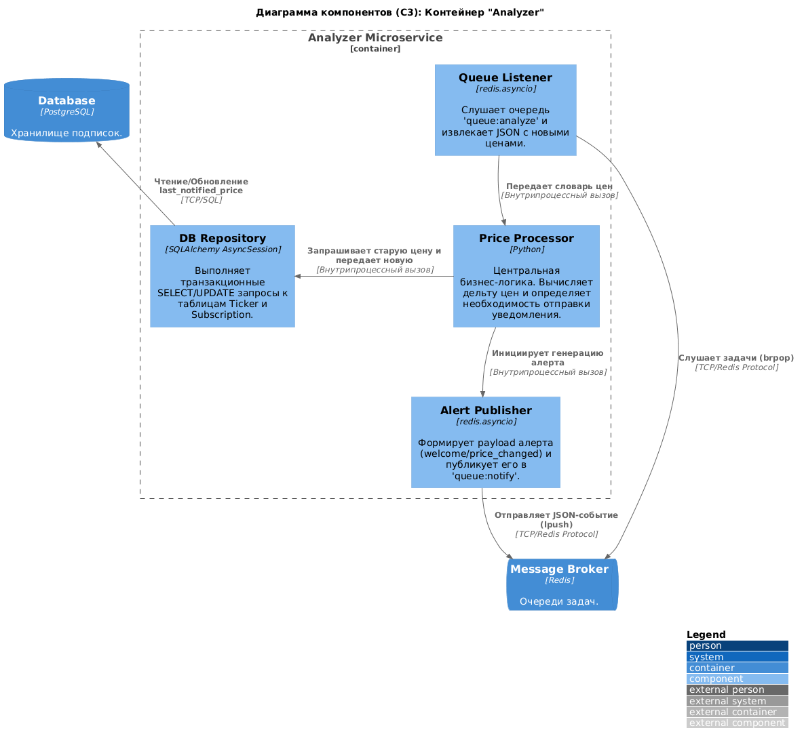
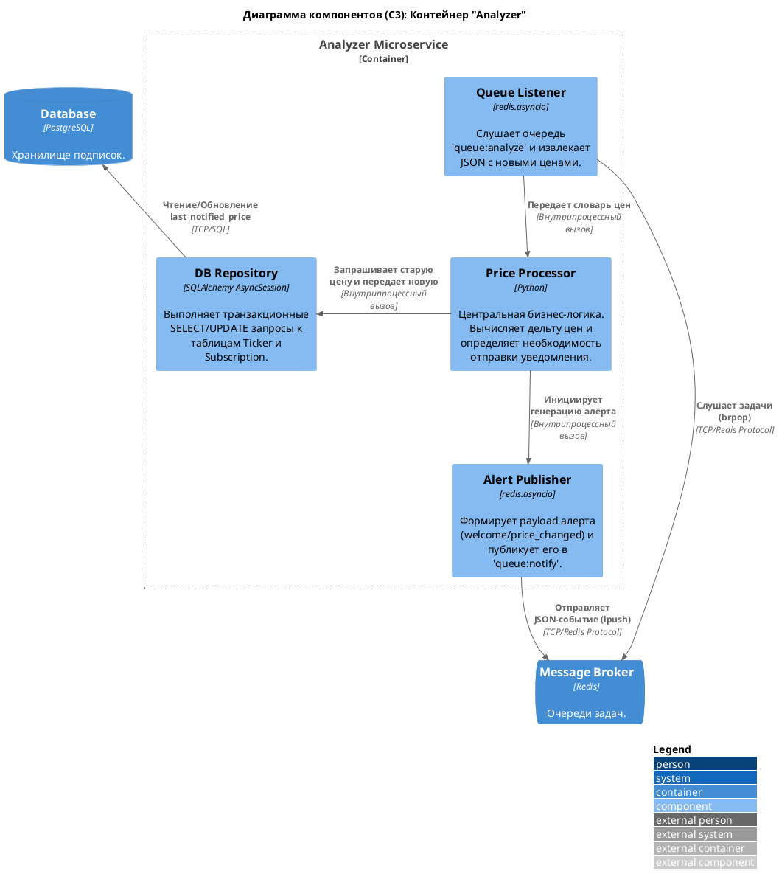

# Практика 1 (9)

## Problem Statement:

Система «MOEX Price Alert» предназначена для инвесторов и трейдеров, желающих отслеживать изменение цен на акции Московской Биржи. Основные функции системы включают управление подписками через удобный интерфейс Telegram-бота, периодический сбор котировок с MOEX ISS API и асинхронную отправку уведомлений пользователю при изменении стоимости активов. 
Система построена на событийно-ориентированной микросервисной архитектуре и состоит из 5 независимых компонентов (API Gateway, Scheduler, Parser, Analyzer, Notifier), взаимодействующих через брокер сообщений Redis, с хранением состояния в PostgreSQL и управлением админом через веб-интерфейс с OpenAPI.

## Диаграмма Контекст

### Скриншот

### Ссылка на соответствующий .puml файл

./diagrams/context.puml

### Таблица

| Аспект | Что сгенерировал ИИ | Что исправлено вручную | Обоснование исправления |
| - | - | - | - |
| Импорт библиотеки | Внешняя ссылка !include https://... | Встроенный макрос !include <C4/C4_Context> | Предотвращение ошибок CORS и блокировок в онлайн-рендерерах. |
| Именование внешних систем | Использовалось непоследовательное название Telegram | Приведено к единому стандарту Telegram API | Обеспечение согласованности терминологии между всеми уровнями C4. |
| Направление связей | Использовались обычные стрелки Rel | Заменены на направленные стрелки Rel_D, Rel_R, Rel_U | Улучшение читаемости графа и предотвращение визуального пересечения линий. |
| Внешние акторы | Обобщенные понятия ("Интернет-магазины") | Заменено на конкретный API-провайдер ("MOEX ISS API") | Архитектура была пересмотрена в Практике 2: осуществлен пивот от парсинга HTML-страниц к работе с официальным API Московской биржи. |
| Интерфейс пользователя | Размытые связи REST-взаимодействия с пользователем | Явное указание интерфейса (Telegram App) | Пользователь взаимодействует с системой исключительно через мессенджер, что делает REST API скрытым от конечного юзера. |

### Вывод о пригодности ИИ для проектирования архитектуры. 

ИИ отлично справляется с генерацией базового каркаса контекстной диаграммы и быстрым переводом текстовых требований (Problem Statement) в код PlantUML. Однако он требует ручной корректировки для настройки визуального форматирования (направления стрелок), устранения технических проблем с импортом библиотек, устранения несогласованности по части имен составляющих архитектуры.

## Диаграмма Контейнер

### Скриншот

### Ссылка на соответствующий .puml файл

./diagrams/container.puml

### Таблица

| Аспект | Что сгенерировал ИИ | Что исправлено вручную | Обоснование исправления |
| - | - | - | - |
| Детерминированность логики | Публикация задач в очередь была помечена как (опционально) | Зафиксирована жесткая связь без опциональности | Системный дизайн должен быть детерминированным и однозначно описывать потоки данных. |
| Паттерн взаимодействия с очередью | Стрелка направлена от воркера к очереди как прямой синхронный запрос | Уточнено направление и тип связи (воркер слушает брокер) | Точное отражение паттерна асинхронного взаимодействия Queue Consumer. |
| Согласованность компонентов | Отсутствовало указание протоколов взаимодействия на некоторых связях | Добавлены явные указания TCP/AMQP и TCP/SQL | Повышение технической точности архитектурного документа. |
| Декомпозиция системы | Монолитный "Background Worker", выполняющий все фоновые задачи | Воркер разбит на независимые микросервисы | Переход к истинной микросервисной архитектуре (Single Responsibility Principle) для независимого масштабирования узких мест (например, парсера биржи). |
| Очереди сообщений | Одна общая очередь "Task Queue" | Указаны 3 независимые событийные очереди (queue:parse, queue:analyze, queue:notify) | Событийно-ориентированная архитектура требует изоляции топиков для правильного роутинга между микросервисами. |
| Управление админом | Отсутствие пользовательского интерфейса для управления. | Добавлен контейнер Admin Frontend (React/Vite) и расширена роль API Gateway до полноценного REST-сервера на FastAPI. | Системе потребовалась административная панель для визуального контроля метрик и подписок, что потребовало внедрения паттерна SPA (Single Page Application). |

### Вывод о пригодности ИИ для проектирования архитектуры. 

На уровне контейнеров ИИ способен корректно определить основные системные блоки (API, БД, Воркер, Очередь), но склонен добавлять архитектурные неопределенности ("опциональные" связи) и иногда путает паттерны взаимодействия (например, pull/push для очередей). Ручной контроль необходим для фиксации жесткой архитектурной логики.

## Диаграмма Компонент

### Скриншот

### Ссылка на соответствующий .puml файл

./diagrams/component.png

### Таблица

| Аспект | Что сгенерировал ИИ | Что исправлено вручную | Обоснование исправления |
| - | - | - | - |
| Именование компонентов | Шаблонные названия (Репозиторий БД, Сервис уведомлений) | Доменные специфичные имена (Subscription Repository, Telegram Notifier) | Повышение точности декомпозиции и привязка к конкретной бизнес-логике. |
| Кросс-функциональные требования (CFR) | Отсутствие упоминаний отказоустойчивости и ограничений | Добавлены паттерны Retry, Rate Limiting, Ack/Nack в описания компонентов | Отражение нефункциональных требований к надежности (сетевые отказы, лимиты API). |
| Поток управления (Control Flow) | Разрозненные вызовы компонентов без явного центра | Централизация логики через Price Change Analyzer | Явное выделение компонента-оркестратора, управляющего бизнес-процессом. |
| Фокус рассмотрения | Рассматривалась архитектура устаревшего монолитного воркера | Фокус смещен на микросервис Analyzer как на ядро бизнес-логики | Так как парсинг и уведомления вынесены в отдельные сервисы, C3 диаграмма должна детально показывать флоу работы с БД и формирования алертов внутри анализатора. |
| Инструментарий | Указаны технологии BeautifulSoup / HTTP Clients | Заменены на Redis Pub/Sub и SQLAlchemy | Отражение реального стека Практики 2: анализатор не делает внешних запросов, а работает исключительно с брокером сообщений и СУБД. |

### Вывод о пригодности ИИ для проектирования архитектуры. 

ИИ отлично справляется с генерацией базового каркаса C4-диаграмм и быстро переводит текстовые требования в код PlantUML. Однако ИИ склонен к упрощению систем (предлагая монолитные воркеры вместо гранулярных микросервисов) и часто не видит потребности в разделении очередей сообщений. Построение качественной событийно-ориентированной архитектуры (Event-Driven) требует жестких корректировок со стороны архитектора-человека, но ИИ берет на себя всю рутину по написанию синтаксиса визуализации.
